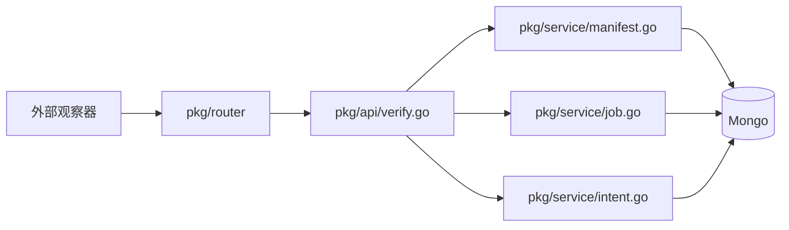

# 架构说明

`devflow-verify-service` 是 Devflow 的执行结果写回服务，只负责 `Verify`。

## 职责

- 提供 Tekton、Argo 和 release step 的写回入口
- 把外部执行结果回写到 `Manifest`、`Job`、`Intent`
- 提供统一的 HTTP 入口、健康检查和 Swagger 文档

## 依赖

- HTTP 层：`Gin`
- 启动与观测基础设施：`../devflow-service-common`
- 数据层：Mongo

## 请求链路

## 不负责的内容

- `Project` CRUD
- `Application` CRUD
- `Configuration` CRUD
- `Manifest` / `Job` / `Intent` 的对外查询和变更接口
- Tekton、Argo 的主动执行调度

## 目录职责

- `cmd/main.go`：进程入口
- `pkg/config/`：配置加载与基础设施初始化
- `pkg/router/`：verify 路由注册
- `pkg/api/`：verify handler
- `pkg/service/`：最小写回逻辑
- `pkg/model/`：写回所需最小模型
- `docs/`：仓库级文档与 Swagger
